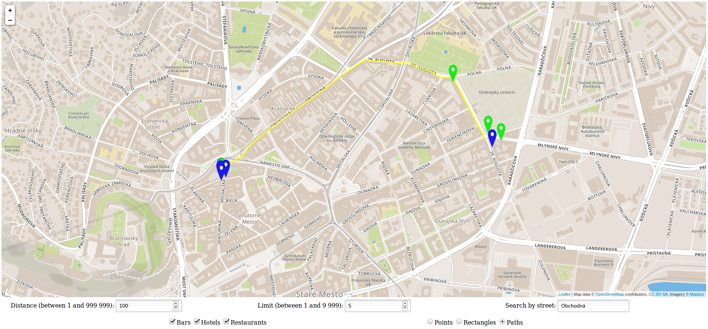

# Overview
Aplikácia zobrazuje bary, hotely a reštaurácia nachádzajúce sa na Slovensku. Používateľ môže vďaka aplikácii vyhľadať tieto objekty:
- v okolí zvoleného bodu na mape
- vo vnútri plochy, ktorú zvolil
- na základe názvu ulice, v okolí ktorej sa nachádzajú
- a najkratšiu cestu medzi nimi

# Screenshot


# Frontend
Frontend aplikácie je tvorený HTML stránkou `src/index.html`, ktorá zobrazuje mapu z [mapboxu](https://www.mapbox.com/), grafické prvky sú na mapu pridávané pomocou [leaflet.js](http://leafletjs.com/). Používateľ má možnosť zvoliť si, ktoré objekty sa mu budú pri vyhľadávaní zobrazovať, môže si vybrať medzi barmi, hotelmi a reštauráciami.

Javascript pre frontend sa nachádza v `src/index.js`, volaný je zo spomínaného `src/index.html`. Úlohou tohto kódu je iba transformovať požiadavky používateľa na API volania a odpovede z backendu zobrazovať na mape v podobe bodov, čiar či polygónov.

# Backend
Backend aplikácie je napísaný taktiež v javascripte, konkrétne som použil [Express](https://expressjs.com/), čo je framework pre [node.js](https://nodejs.org/en/). Zdrojový kód iba volá databázový server, z ktorého mu prichádzajú dáta rovno vo formáte [GeoJSON](http://geojson.org/).

## Data
Dáta sú stiahnuté priamo z Open Street Map. Po rozbalení mali veľkosť približne 4.2GB. Dáta boli importované do databázy pomocou príkazu `osm2pgsql -m -U postgres -W -H localhost /data/slovakia-2017-10-03.osm`. Z týchto dát som vytvoril tabuľku obsahujúcu všetky body, ktoré má používateľ možnosť vyhľadávať. Zatiaľ čo importované dáta sú v projekcii WGS 84, nová tabuľka má projekciu 3857 [pseudo-mercator](https://epsg.io/3857), kvôli hľadaniu vzdialenosti medzi jednotlivými bodmi. Pre potreby vyhľadávania najkratšej cesty medzi zvolenými bodmi bola použitá mapa Bratislavy s veľkosťou približne 230MB. Nahrávanie ciest celého Slovenka viackrát zlyhalo, preto bola použitá zmenšená verzia. Mapa Bratislavy vznikla z pôvodnych dát príkazom `osmosis --read-xml /data/slovakia-2017-10-03.osm --bb left=16.9467007 right=17.2915841 top=48.2631366 bottom=48.0208239 --write-xml /data/bratislava-2017-10-03.osm`. Vytvorenie databázy a importovanie dát som robil pomocou príkazu `   23  osm2pgrouting --f /data/bratislava-2017-10-03.osm --dbname routing --username postgres --password postgres --clean`. Všetky dotazy na databázu, ako aj vytvárenie spoločnej tabuľky sa nachádzajú v adresári `queries`.

# API
`GET /search?name=hviezda&lat=25346&long=46346123`

**Nájde 5 najbližších hotelov a barov v okolí zvoleného bodu, do vzdialenosti 40 metrov**

`GET /points?amenity[]=hotels&amenity[]=bars&lat=48.1475394803097&lng=17.1105918328104&distance=40&limit=5`

**Nájde 5 hotelov a barov v ploche zvoleného obdĺžnika**

`GET /rectangles?amenity[]=hotels&amenity[]=bars&lat[]=48.1482637&lng[]=17.1088840&lat[]=48.1472665&lng[]=17.1100680&limit=5`

**Nájde najkratšiu cestu medzi zvolenými bodmi a pri každom bode nájde 5 najbližších hotelov**

`GET /paths?amenity[]=hotels&lat[]=48.1706649589215&lng[]=17.10554122924805&lat[]=48.144327019795156&lng[]=17.087516784667972&limit=5`

**Nájde najbližšiu ulicu Obchodná od súčasnej pozície a v okolí 100 metrov od nej nájde 25 nabližších reštaurácií a barov**

`GET /streets?amenity[]=restaurants&amenity[]=bars&lat=48.1475394803097&lng=17.1105918328104&distance=100&limit=25&street=Obchodná`

# Response
API vracia pole GeoJSONov s informáciami o bode, ktorý popisuje. Môže sa jednať napríklad o názov podniku, jeho typ a vzdialenosť od zvoleného bodu na mape v metroch. V prípade vyhľadávania podnikov pri ceste, je vrátená vzdialenosť od aktuálnej polohy na mape ale aj vzdialenosť od nájdenej ulice. V prípade hľadania najkratšej cesty je API volané 2x, raz kvôli najbližším bodom a druhý krát kvôli ceste k ďalšiemu bodu. Druhé volanie vráti iba pole čiar, ktoré zodpovedajú ceste do ďalšieho bodu. Príklad GeoJSONu, ktorý vráti backend:
```
[
  {
    "type": "Feature",
    "geometry": {
      "type": "Point",
      "coordinates": [
        17.1105610205962,
        48.1477468017016
      ]
    },
    "properties": {
      "amenity": "cafe",
      "category": "bars",
      "distance": 34.7596461514253,
      "name": "Greentree Caffe"
    }
  }
]
```
